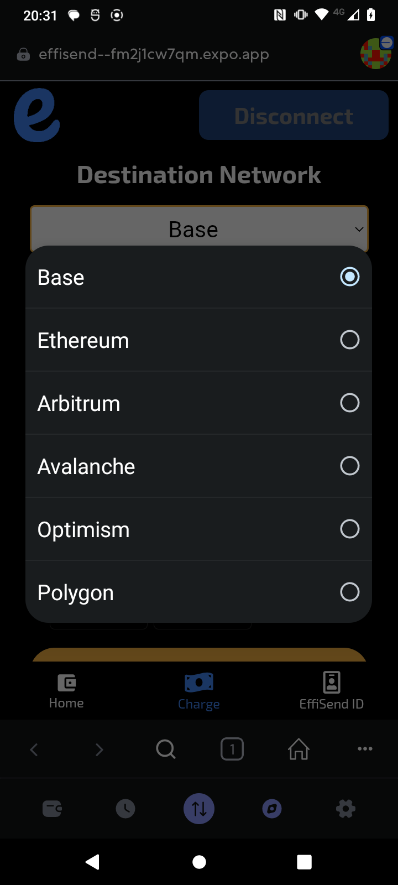

# EffiSend

EffiSend: Next-generation crosschain payment dApp with **MetaMask SDK**, **Circle Wallets**, and **LiFi** (via CCTPv2) — enabling FaceID, QR payments, and instant cross-chain transfers all in one.


<br>

# ⚡Fast Links:

APP CODE: [CODE](./effisend-meta/)

WEB DAPP: [LINK](https://effisend.expo.app)

VIDEODEMO: [LINK](pending...)

<br>

# 🚀 System Diagram

EffiSend is built entirely from scratch to leverage the most advanced web3 infrastructure for multi-chain payments and wallet management:


- [**MetaMask SDK**](./effisend-meta/src/providers/metamaskProvider.js)  
  Handles native user wallet connections, network switching, account management, and secure token approvals. It ensures users maintain full control over their own MetaMask wallets, while enabling the dApp to interact seamlessly through a custom React context with retries, session persistence, and event tracking.

- [**Circle Developer Controlled Wallets**](./cloud%20functions/excecute-transactions.js)
  Provide secure, non-custodial programmable wallets managed via Circle’s infrastructure. This lets us perform operations like `createTransaction` (native transfers) or `createContractExecutionTransaction` (ERC20 transfers, approvals, or custom contracts) without ever exposing private keys, all tied to a DID or FaceID stored securely in Firestore.

- [**LiFi SDK**](./cloud%20functions/excecute-transactions.js)
  Enables effortless cross-chain routing, creating optimal routes for bridging and swaps across blockchains, and executing them via the Circle DCWs. With **CCTPv2** under the hood, users can pay in one chain or token and settle on another, with the entire complexity hidden from them.

## 🦊 MetaMask SDK

At the heart of EffiSend is the `MetaMaskProvider` — a robust custom React context built around the **MetaMask SDK**. 

  

This core component handles everything needed to integrate MetaMask into a modern progressive web dApp:

- Initializes MetaMask SDK with automatic retry strategy.  
- Connects the wallet, switches chains, tracks accounts & chain ID.  
- Persists user sessions in `AsyncStorage` (so reconnect is seamless).  
- Adds automatic event listeners for `accountsChanged`, `chainChanged`, and `disconnect`.  
- Exposes easy hooks like `useMetaMask` and `useMetaMaskConnection` across the app.

### Example usage (with hooks)
```javascript
import { useMetaMask } from './metamaskProvider';

const { isConnected, connectWallet, account } = useMetaMask();

return (
  <>
    {isConnected ? <Text>Wallet: {account}</Text> : 
      <Button onPress={connectWallet} title="Connect MetaMask" />}
  </>
);
```

### Under the hood
The `MetaMaskProvider` file does much more than a basic integration:

- Keeps the SDK and provider inside refs, to stay alive across re-renders.
- Initializes only once on mount, with up to 3 attempts (`maxInitializationAttempts`).
- Uses:
  ```javascript
  const MMSDK = new MetaMaskSDK({ dappMetadata });
  await MMSDK.init();
  ```
- Automatically reconnects if the user previously approved it, by checking `@metamask_connection_preference` in AsyncStorage.
- Reactively saves the last connected account.

All technical implementations for cross-chain payments are included here.

- [Metamask Provider](./effisend-meta/src/providers/metamaskProvider.js)
- [Connect Button](./effisend-meta/src/components/header.js)
- [Sign In](./effisend-meta/src/components/header.js)

## 🔐 Circle Developer Controlled Wallets. 

EffiSend uses **Circle Developer Controlled Wallets** to handle all payments, approvals, and contract executions securely — without ever exposing private keys. **Each wallet is linked to a user’s FaceID**

### Programmable transactions

Our Cloud Function uses the official Circle Wallets SDK to:

- Execute native token transfers
- Execute ERC20 token transfers via smart contract.
- Execute cross-chain bridging via LiFi and CCTPv2

### Example for a **native on-chain payment**:

```javascript
await circleDeveloperSdk.createTransaction({
    amount: [amount],
    destinationAddress,
    walletId: wallet.id,
    blockchain,
    fee: { type: "level", config: { feeLevel: "MEDIUM" } }
});
```

### For ERC20 payments, we encode the contract call:

```javascript
const interface = new ethers.utils.Interface(abiERC20);
const transaction = interface.encodeFunctionData("transferFrom", [
    address,
    destinationAddress,
    ethers.utils.parseUnits(amount, decimals)
]);
await circleDeveloperSdk.createContractExecutionTransaction({
    walletId: wallet.id,
    callData: transaction,
    contractAddress: token,
    fee: { type: "level", config: { feeLevel: "MEDIUM" } }
});
```

All technical implementations for cross-chain payments are included here.

- [Cloud Function](./cloud%20functions/excecute-transactions.js)

## 🌉 LiFi Cross-chain Routing (integrated with Circle Wallets)

When users want to pay across chains (e.g. USDC on Base → USDC on Arbitrum), EffiSend uses **LiFi SDK** to:

1. Fetch the optimal quote for bridging + swap:

```javascript
const quoteRequest = {
    fromChain: chainsId[chainFromIndex], 
    toChain: chainsId[chainToIndex], 
    fromToken: tokens[chainFromIndex][tokenIndex].address,
    toToken: tokens[chainToIndex][tokenIndex].address,
    fromAmount: ethers.utils.parseUnits(
        amount,
        tokens[chainFromIndex][tokenIndex].decimals
    ),
    fromAddress: wallet.address,
    toAddress: destinationAddress,
    allowBridges: ["mayanMCTP", "celercircle"], // Allow CCTP only
};
const quote = await getQuote(quoteRequest);
const route = convertQuoteToRoute(quote);
```

2. Approve the LiFi contract on the origin chain:

```javascript
const transactionApproval = interface.encodeFunctionData("approve", [
    transaction.to, quoteRequest.fromAmount
]);
await circleDeveloperSdk.createContractExecutionTransaction({
    walletId: wallet.id,
    callData: transactionApproval,
    contractAddress: token,
    fee: { type: "level", config: { feeLevel: "MEDIUM" } }
});
```

3. Execute the LiFi contract which performs the bridge + swap:

```javascript
await circleDeveloperSdk.createContractExecutionTransaction({
    walletId: wallet.id,
    amount: ethers.utils.formatEther(transaction.value),
    callData: transaction.data,
    contractAddress: transaction.to,
    fee: { type: "level", config: { feeLevel: "MEDIUM" } }
});
```

All technical implementations for cross-chain payments are included here.

- [Cloud Function](./cloud%20functions/excecute-transactions.js)

<br>

# Features:

EffiSend’s architecture allows users to complete payments on **any supported chain** with a single FaceID scan or QR interaction — fully abstracting away network, swap, and bridging complexities. 

## 📷 FaceID + QR Payments (On Top of Circle + LiFi)

EffiSend adds a human layer with **biometric FaceID** and **secure QR payments**.

- Scan face to link or pay with your Circle wallet.
- Or scan a QR code tied to a payment nonce.
- Shows balances from multiple chains.
- Aggregates USD values using Coingecko.
- Makes it easy for users to fund their FaceID wallet from MetaMask using native or ERC20 tokens.

Screenshots:


## 💰 Cross-chain LiFi Payments

All payments flow back into the **Circle Wallets + LiFi engine**, meaning:

- You can pay from any supported chain.  
- No manual bridging.  
- Still fully controlled by Circle.





## 🥇 Trust Score & Rewards

- Biometric verification (FaceID) unlocks a trust score and EFS token rewards.
- Verified users get reduced fees on transactions.


<br>

# 📚 Main Codebase Map

| File / Component           | What it does                                   |
|-----------------------------|-----------------------------------------------|
| [`metamaskProvider.js`](./effisend-meta/src/providers/metamaskProvider.js)       | MetaMask SDK wallet connection & session.     |
| [`tab1.js`](./effisend-meta/src/app/(screens)/tabs/tab1.js)                   | View balances, fund FaceID wallet, generate QR for payments|
| [`tab2.js`](./effisend-meta/src/app/(screens)/tabs/tab2.js)                   | Pay via FaceID or QR, with LiFi cross-chain.  |
| [`tab3.js`](./effisend-meta/src/app/(screens)/tabs/tab3.js)                   | Trust score, profile, claim EFS rewards.      |
| [`receipt.js`](./effisend-meta/src/app/receipt.js)                | Payment receipt with explorer QR.             |
| [`camFace.js`](./effisend-meta/src/components/camFace.js) / [`camQR.js`](./effisend-meta/src/components/camQR.js)   | Camera inputs for biometric & QR.             |
| [`header.js`](./effisend-meta/src/components/header.js)                 | Connect/disconnect MetaMask.                  |

# 🔗 References

1. [MetaMask SDK](https://github.com/MetaMask/sdk)
2. [Circle Developer Controlled Wallets](https://developers.circle.com)
3. [LiFi Crosschain Routing](https://www.lifi.io)